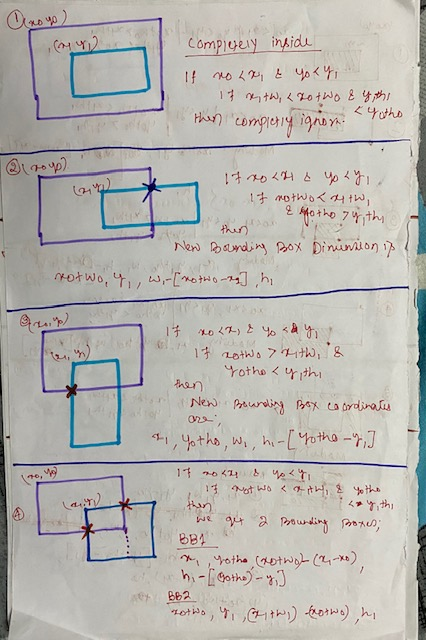
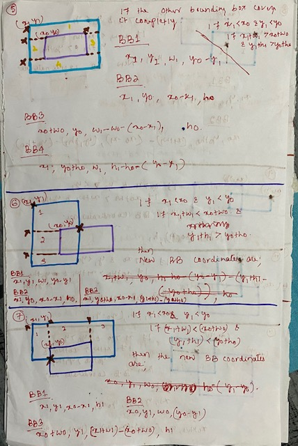
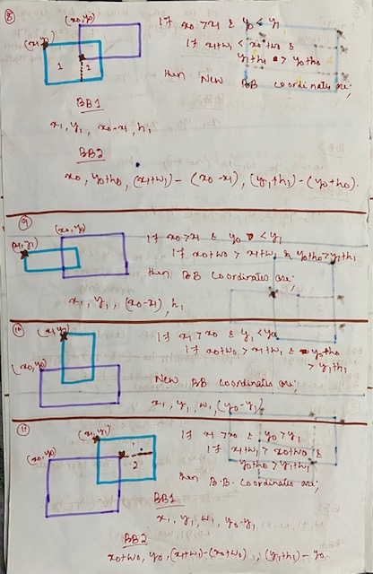
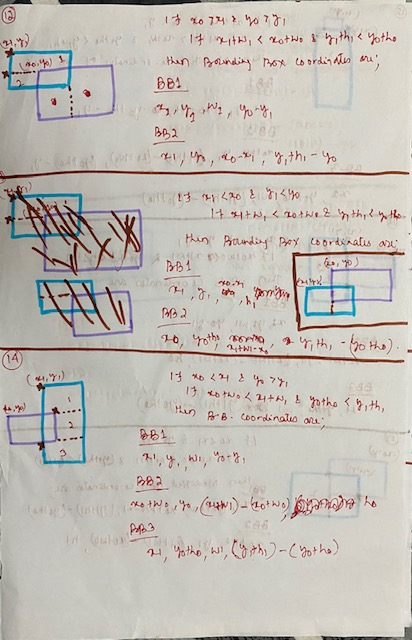
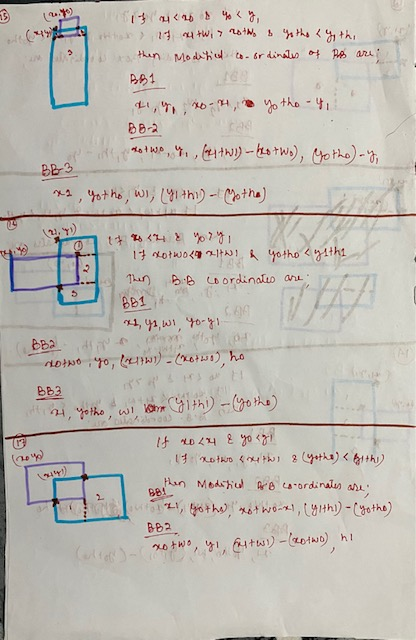
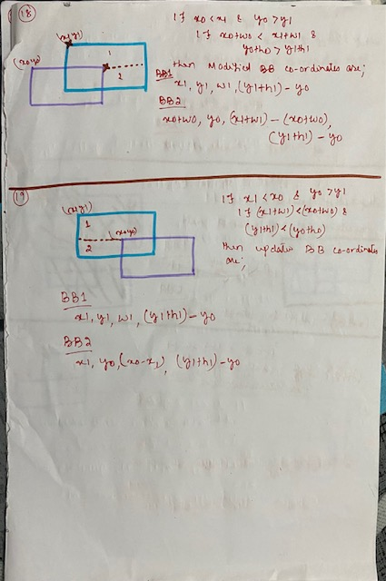
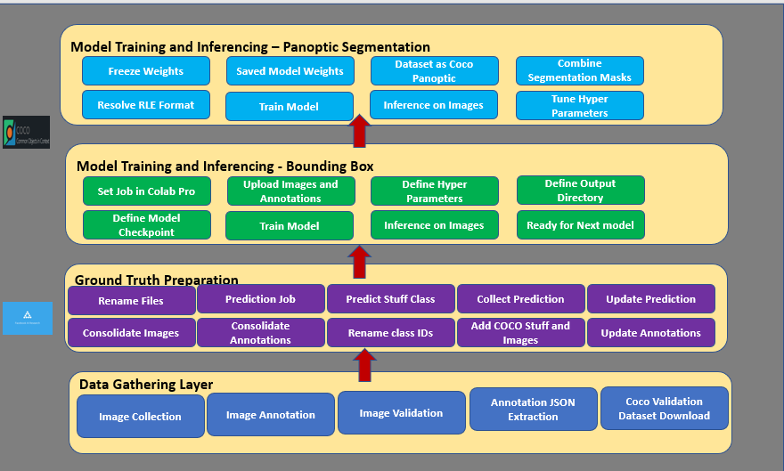

# Project Name: 
Performing Panoptic Segmentation on Construction Materials and machineries 
# Subproject: 
Predicting Bounding Boxes for the Construction Materials 

# Summary:
Computer Vision is the discipline under a broad area of Artificial Intelligence which teaches machines to see. There are many applications of computer vision using deep learning techniques. Image Classification, Text Extraction, Form Recognition and Object detection are Majority of Computer Vision applications. Many Algorithms has been developed in the past to cater these tasks. While Image classification is a relatively easier task to do, object detection needs a lot of experience and expertise to achieve the desired result. Many Deep Learning engineers take the help of pretrained models which are trained using ImageNet Data, Tiny ImageNet Data or Coco datasets for their regular jobs and has been quite popular. However, when it comes to perform Object detection on custom datasets the task becomes time consuming, tedious and difficult. At TheSchoolofAI during the last EVA sessions we had successfully Trained our custom images using many of the popular Algorithms like Yolo V2/V3/V4 and RCNN Family of Algorithms for Object Detection and SOA image classification models like Resnet, Inception, Xception etc. But TheSchoolofAI always thrives on change and excellence. Hence as part of the Capstone Project of EVA6 our mentor assigned us the task of performing Panoptic segmentation on Construction Materials. This Repository Contains the Part-2 of the Project which is to identify the Objects and draw bounding Box around that 
# Taks 

•	Collect at least 500 images for each category of construction materials (Initially we decided to use 100 types/classes of objects). The images should contain other objects in it 

•	Annotate the objects using the tool provided/customized by the school of AI team. The annotations are not simple bounding boxes rather polygons which should cover all the parts of the material/machinery 

•	The Images must be reviewed and finalized before getting into the final Dataset 

•	Overall, we had 11000 images selected to be included as part of the training 

•	Develop a code which would perform inferencing on the 11000 images using DETR Panoptic Segmentation Pretrained model on Coco Dataset (For more on DETR please refer to Part-1 of Capstone project)

•	Collect the Output of the Inferencing from the model

•	It’s expected that the Output will mislabel the construction materials and machineries as it has never been trained on that. Hence, we will Categorize those as miscellaneous Stuff class (If you don’t already know what is Thing and Stuff in DETR please refer to Part-1 of Capstone Project)

•	The Coco thing class category ids are from 1-90. However, for us the thing is our labeled dataset. So, from the resultant dataset we would ignore coco classes from 1-90 

•	However, we would keep the stuff classes as we never annotated the stuff classes, so we would take the coco stuff classes 

•	As our images may not contain all the stuffs, so we would also add the COCO Validation Dataset images and annotations for our training. The Training dataset is huge; hence we would manage with validation one 

•	Now Prepare the Ground Truth for Training the model for predicting bounding boxes around custom objects 

•	Once the Model is trained with predicting bounding boxes, we would then train the segmentation head

# Ground Truth Preparation
1. Rename Files: The Images of different thing classes may contain same file name. Hence the First task was to rename the image file by adding prefix of the class name 
2. Predict Stuff Present in the Image:  The stuff annotations are collected from the prediction of the DETR Panoptic segmentation Pretrained model. Each image is predicted with DETR panoptic segmentation code having resnet101 backbone which was pretrained with Coco dataset. The bounding boxes predicted by DETR panoptic segmentation for those with bounding confidence more than 0.85.
3. Collect the Details in an External file: The details of prediction is collected into a csv file (Bounding box, Segmentation, Category, Area etc.)
4. Modify the Predicted Values: 
The Value in Predicted Bounding boxes are in the range of 0-1 (Scaled). However, we need to descale it based on the image size. Hence, we performed the following logic to bring the original pixels of the bounding boxes.
  
  •	The bounding box predicted by DETR:  Xcenter, Ycenter, width and height 
  
  •	Coco dataset bounding box  Xleft, Yleft, width, height which are actual pixel position. 
  
  •	Xleft = Image Width * ( Predicted Xcenter - 0.5 * Predicted width) Yleft = Image Height * ( Xcenter - 0.5 * Predicted height)
  

# Consolidate All Images and Annotations:
The Idea here is to create 2 Datasets (one for training and another for validation with 90:10 ration). Hence the program for consolidation is designed to pick every tenth record and add that to validation set while the other 9 goes to training set
Read each Annotation file Individually and consolidate. 
# Rename the Classes : 

0 – Misc Stuff

1-48 : Annotated thing classes

49-157 : Coco Stuff classes 

# Add the COCO Stuff image and Annotations 
Download the COCO validation stuff images and annotations 
Again, using programming technique every tenth record should go to the validation set 
While updating the annotations we ensured that any stuff object overlapping the annotated thing object must be removed (either completely or partially based on the defined criteria, Images pasted) 

While updating we also need to ensure that any image which is not RGB must be removed 
Final Datasets 
Finally, we have two image folders and two annotations (One of Train and another for validation)

# Process Flow 

# Training Process

The Structure of the folder During Training 

/content/drive/MyDrive/datanew/custom
    ├ annotations/ # JSON annotations
    │ ├ annotations/custom_train.json
    │ └ annotations/custom_val.json
    ├ train2017/ # training images
    └ val2017/ # validation images
    
The DETR code repository 

https://github.com/woctezuma/detr.git 

pretrained weights are loaded from 

https://dl.fbaipublicfiles.com/detr/detr-r50-e632da11.pth'

Output Directory : 

/content/drive/MyDrive/datanew/outputdir

Checkpoint : 

Customcheckpoint

# Hyperparameters:
Number of queries: 80 Learning Rate: 1e-5 Number of classes: 158

# Issues During Training 

In case you are finding these issues 
# Model Training is giving CUDA Error: 
I found this error multiple times. The reasons behind that were 

1.	Hardcoding of the number of classes as 2 in detr.py
2.	The bounding boxes size exceeded the image size
3.	The Bounding boxes contain negative values 

Solution: 
Modify the number of classes to 158
Reextracted the bounding boxes by checking the x+width and y+height with image width and height. Then I dropped the bad values 

# Class Imbalance: Found class to be biased towards few including misc stuff
Solution: Removed few low confidences stuff classes and class with more objects 

# Colab Restarted Multiple Times: The colab restarted after 36-37 epochs 
Solution : Saved and Restarted from check point  
 
# Output of the Training 

