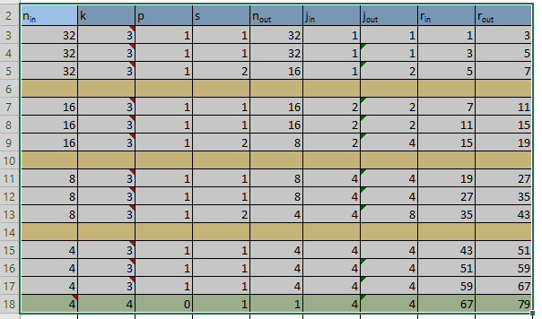
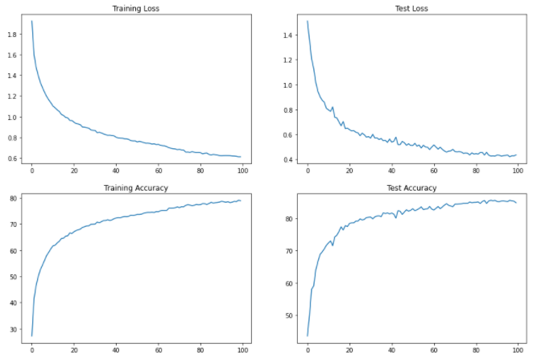
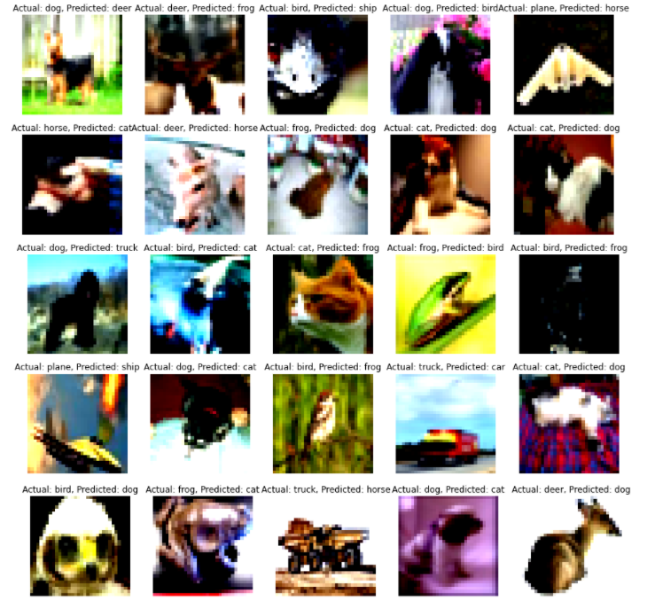

# Assignment 5 – EVA 6
• Developers
•	Monimoy Purkayastha (monimoyd@gmail.com)
•	Nihar Kanungo (nihar.kanungo@gmail.com)
# Requirement
1.	Design a Network with 4 Blocks C1C2C3C4O.
2.	Can not use Maxpooling, instead use 3 - 3x3 layers with stride of 2 
3.	RF must be more than 44 
4.	One of the layers must be Depth wise Separable Convolution
5.	One of the layers should have Dilated separable convolution
6.	GAP should be used
7.	use albumentation library and apply:
1.	horizontal flip
2.	shiftScaleRotate
3.	coarseDropout (max_holes = 1, max_height=16px, max_width=1, min_holes = 1, min_height=16px, min_width=16px, fill_value=(mean of your dataset), mask_fill_value = None)
8.	Achieve 85% accuracy or more 

# Experiments Performed 
We performed many experiments on 
•	Model building 
•	Hyper parameters 
•	Augmentation 
Following is few to consolidate 

**Experiment-1 **

Model Structure 
•	4 Blocks 
•	Each block contains 3 3x3 kernel
•	Number of channels are 32-64-128 
•	Transition layer to reduce the number of channels to 32
•	Dilated Kernel and DSC in one of the layers 
•	Parameters – 0.3 m
•	Albumentations augmentations
Result:
I have got Train accuracy: 81% validation accuracy:87.89% under 30 epochs 
Analysis:
This model has used a lot of parameters and could able to reach the accuracy over 87%. However, it’s computationally expensive. We need to reduce the number of parameters used in this model and choose Strides of 2 instead of maxpooling to reduce the number of channels 

**Experiment-2**

Model Structure 
•	We used Stride of 2 instead of Maxpooling to reduce the number of channels 
Result:
I have got Train accuracy: 78-79% validation accuracy: 85.47% under 50 epochs 
Analysis:
This model has used a lot of parameters and could able to reach the accuracy over 85%. However, it’s computationally expensive. We need to reduce the number of parameters used in this model

**Experiment-3 **

Model Structure 
•	Reduce the number of channels below 0.2m

Result:
I have got Train accuracy: 80-82% validation accuracy:84.96% under 100 epochs 
Analysis:
This model could not rich over 85% even after running for 100 epochs. We could have run the model for multiple times to achieve that due to randomization of the input weights but that’s not a consistent model. Hence, we need to improve further 

**Experiment-4 **

Model Structure 
Made a change by including “ReduceLROnPlateau” 
Result:
I have got Train accuracy: 79% validation accuracy:86.43% under 100 epochs 
Analysis:
We achieved over 85% accuracy finally. However, we can still improve the model performance by reducing the number of parameters. Let’s try to keep it under 0.1m and see if we can achieve 85% accuracy.

 

# Receptive Field Calculation

# Model Performance Parameters

# Misclassified Images

