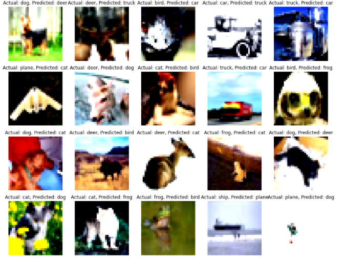

Assignment 8 – EVA 6
==========================
# Developers

• Monimoy Purkayastha (monimoyd@gmail.com)
• Nihar Kanungo (nihar.kanungo@gmail.com)

# Explanation

Create a proper folder structure for this deliverable
Models: Contains the main model file (Resnet18)
Data Transformations: This folder contains the module which will list down all transformation codes
Data Loader: This contains the code for Train and Test data loaders
Utils: This will contain
1.	The Train Test util: The Train and Test Code
2.	 Accuracy util: Holds the code for finding out validation Accuracy
3.	Gradcam Util : Help to perform gradcam on images
4.	misclassified_image_utils : Helps to find out misclassified images
5.	plot_metrics_utils : Helps to find out plots/charts for the model train and test parameters 
Main.py : Contains all the Code for loading
1.	Training 
2.	Model Parameters
3.	Model
4.	Training
5.	Loads incorrect label function and displays 

Constraints 
==============
1.	Train for 40 Epochs
2.	20 misclassified images
3.	20 GradCam output on the SAME misclassified images
4.	Apply these transforms while training:
1.	RandomCrop(32, padding=4)
2.	CutOut(16x16)
3.	Rotate(±5°)
5.	Must use ReduceLROnPlateau
6.	Must use LayerNormalization ONLY

Misclassified Images
=====================

Gradcam Images
=====================

