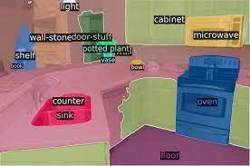
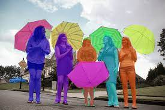

Name : Nihar Kanungo

Topic : This Readme is being prepared for the Part-1 submission of Capstone Project of Phase-1 . The below are an explanation of the questions posted in the assignment section.

Description
================

FROM WHERE DO WE TAKE THIS ENCODED IMAGE?
==============================================
The Encoded image which is of the dimension d x H/32 x w/32 is the output which is fed from the Encoder Network.

The Image which initially passes through the Pre-trained Convolution backbone gets converted into lower resolution followed by projected into a lower dimension value. This value then gets flattened by multiplying the patch width with patch height. This value which is of dimension (Batch Size, Width/32 * height/32, hidden dimension) gets encoded through the encoder layer and becomes the Encoder Hidden state is finally fed into the Decoder layer for classification and bounding box prediction 
 
WHAT DO WE DO HERE?
=====================
In the Decoder layer the multi-headed attention layer gets the input as Number of images (1 Foreground and Many backgrounds) multiplied by the dimensions. 

The Multi-headed attention then calculates the attention score for each object embedding. 

WHERE IS THIS COMING FROM?
==============================
The above step generates the attention mask. Then these attention masks are cleaned using the convolution network that uses the intermediate activation of the backbone 
As a result we get high resolution maps where each pixel contains a binary logit of belonging to the mask 

EXPLAIN THESE STEPS?
======================
The above picture shows the panoptic segmentation method of DETR Decoder network.

The Image which initially passes through the Pre-trained Convolution backbone gets converted into lower resolution followed by projected into a lower dimension value. 
This value then gets flattened by multiplying the patch width with patch height. This value which is of dimension (Batch Size, Width/32 * height/32, hidden dimension) gets encoded through the encoder layer and becomes the Encoder Hidden state is finally fed into the Decoder layer 

In the Decoder layer the multi-headed attention layer gets the input as Number of images (1 Foreground and Many backgrounds) multiplied by the dimensions. The Multi-headed attention then calculates the attention score for each object embedding

Then these attention masks are cleaned using the convolution network that uses the intermediate activation of the backbone. As a result we get high resolution maps where each pixel contains a binary logit of belonging to the mask 

All the above masks are combined by assigning each pixel to the map with highest logits using simple pixel wise argmax

The output value is quite impressive where the network provides segmentation for each thing and stuff

Some quite interesting outputs are shown below 

