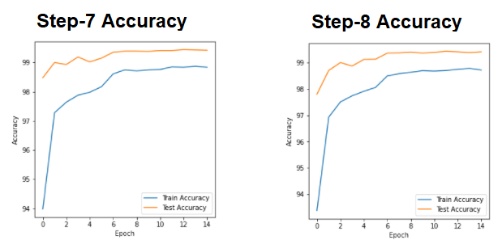

Assignment 5 – EVA 6
========================
•	Developers
o	Monimoy Purkayastha (monimoyd@gmail.com)
o	Nihar Kanungo (nihar.kanungo@gmail.com)

Requirement
==============
Train the Network on MNIST dataset to achieve the following 
1.	99.4% (this must be consistently shown in your last few epochs, and not a one-time achievement)
2.	Less than or equal to 15 Epochs
3.	Less than 10000 Parameters (additional points for doing this in less than 8000 pts)
4.	Do this with 3 steps, But you can increase number of steps if you have things to show 
5.
dnn_pytorch_architecture_change_steps
=========================================
This repository is for the DNN arhitecture change steps on MNIST dataset to achieve 99.4 accuracy in 10K parameters and within 15 epochs I have achived the target in 6 steps below

Step1 of architecture changes:
====================================
Target: In this step I have choosen vanilla architecture of 6 convolution layer and 2 transtion blocks (maxpool) and used GAP in the the last layer. My target is if I can achieve around 99 validation accuracy then i can refine the mode further in later steps. I will run it for 20 epochs which is more than 15) just to study how the accuracy changes in vanila architecture

Result: I have got Train accuracy: 99.62 validation accuracy:99.09 Number of parameters: 40,202

Analysis: I could see that validation accuracy is steadily increasing over epochs, and finally got vlidation accuracy of 99.09 which is a good architecture to explore further. Also noticed that train accuracy 99.62 is much higher than validation accuracy 99.09, so model could be overfitting. But as number of parameters is 40,202 which is around 4 times the target parameters, I will try to reduce the parameters in next step

Step2 of architecture changes:
=================================
Target: In this step I will try to change the vanilla architecture by changing number of parameters within 10,000 . I will reduce number of kernels also remove all the bias parameters by setting bias value to False. I will run for 15 epochs. My expectation is that it may slightly reduce from the validation accuracy achieved in vanilla architecture

Result: I have got Train accuracy:98.99 validation accuracy:98.92 Number of parameters: 8,442

Analysis: As expected validation accuracy has slightly reduced to 98.92 from the vanilla architecure with accuracy 99.09. This could be becuase I reduced number of kernels. But unlike vanilla architecture, the difference between Train Accuray and Validation accuracy is very less, which means it is not overfitting. Also, number of parameters 8442 is well within my target of 10K parameters

Step3 of architecture changes:
==================================
Target: In this step I will change the architecture from step2 by introducing Batchnormalization and Dropout. Expectation is that validation accuracy should increase

Result: I have got Train accuracy: 98.73 validation accuracy: 99.22 Number of parameters: 8,442

Analysis: As expected validation accuracy increased to 99.22 from the step2 model, which has accuracy 98.92. I also observe that validation accuracy 99.22 is much higher than training accuracy 98.73. These could be because of regularization effect of batch normalization and droupout introudced in this step

Step4 of architecture changes:
=================================
Target: In this step I will change the architecture from step3 by introducing Image augmentation of random rotation between -7 to +7 degrees. My expectation is that validation accuracy should increase

Result: I have got Train accuracy: 98.52 validation accuracy: 99.35 99.22 Number of parameters: 8,442

Analysis: As expected validation accuracy increased to 99.35 from the step3 model, which has valicdation accuracy 99.22. I also observe that validation accuracy 99.35 is much higher than training accuracy 98.52. These are because with image augmentation, as CNN could learn from more images. Still after this step, I am behind the target of 99.40 
validation accuracy

Step5 of architecture changes:
=================================
Target: In this step I will change the architecture from step4 by introducing StepLR with step size 6 and gamma value 0.1. My expectation is that validation accuracy should increase

Result: I have got Train accuracy: 98.50 validation accuracy: 99.41 Number of parameters: 8,442

Analysis: As expected validation accuracy increased to 99.41 from the step4 model, which has valicdation accuracy 99.35. StepLR has increased validation accuracy slightly. With this I have achieved the target validation accuracy with only 8,442 parameters and within 15 epcohs. However, if I check the validation accuracy of last five epochs are 99.17, 99.33, 99.37, 99.33, 99.41 which has large variance so looks like the model is still not stabilized. So, I will try to make more changes to stabilize the model in step6

Step6 of architecture changes:
=================================
Target: In step5 I noticed that the validation accuracy has not stabilized in last 4 epochs. In this step, I will change the batch size to 64 and check if the validation accuracy has stabilized or not

Result: I have got Train accuracy: 98.56 validation accuracy: 99.41 Number of parameters: 8,442

Analysis: In this step, I could see the validation accuracy is 99.41 which is same as the validation accuracy in step5. However, when I check the last 5 epochs validation accuracies are: 99.38,99,41,99.39,99,39,99.41 which is steadier with less variance so model has stabilized. Difficult to explain exact reason for this but one possibility could be because when I used the smaller batch size of 64, the variance in each batch is less compared to batch size of 128. With this I have achieved all the requirements as 
mentioned in the assignment

Step7 of architecture changes:
================================
Target: We saw in the last run that the validation accuracy is around 99.4 towards the last couple of epochs. But on 13th & 14th Epoch it slipped to 99.38. MNIST is a easy dataset, so can we learn faster to achieve this accuracy in lesser number of epochs and with more consistency? Let's check it out

Result: I have got Train accuracy: 98.87 validation accuracy: 99.44 Number of parameters: 8,582

Analysis: In this step, I could see the validation accuracy improved to 99.44 which is more than the validation accuracy in step6. However, when I check the last 5 epochs validation accuracies are: 99.41,99,41,99.44,99,43,99.42 which is steadier with less variance so model has stabilized. I believe the reason behind that is the learning rate which is higher than the other networks and that helped the network to learn faster. This may not be the right fit for all kind of data as higher learning rate may miss the minima. But as MNSIT is a simple dataset this seems to work better

Step8 of architecture changes:
===================================
Target: We saw in the last run that the validation accuracy is around 99.44 and very stable as the last 5 epochs were above 99.4. Target Achieved. Then what's this. This one is to enhance the network further and see if we can achieve the accuracy with less than 8000 parameters. But wait, this was supposed to be done in Step-2. Yes right, but first we wanted to achieve the target of 99.4 with less than 10k steps. Once achieved we need to enhance it further if we can. So, let's try

Result: I have got Train accuracy: 98.73 validation accuracy: 99.43 Number of parameters: 7,836

Analysis: We changed the number of kernels slightly for the first couple of layers. We know at this layer it extracts edges and gradients and with MNIST we could extract those with lesser feature extractors. Hence with a smaller number of parameters we achieved the required accuracy

Accuracy for Step-7 & Step-8
================================

Nest Steps
============
Let’s see if we can improve the accuracy further or reduce the parameters further to achieve the same result 

