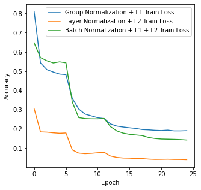
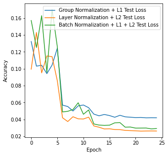
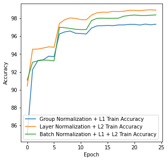
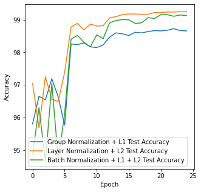

Assignment 6 – EVA 6
=====================
• Developers
   • 	Monimoy Purkayastha (monimoyd@gmail.com)
   •	  Nihar Kanungo (nihar.kanungo@gmail.com)

Requirement
=============
1.	We need to make 3 version of Assignment -5 as follows
1.	Network with Group Normalization + L1
2.	Network with Layer Normalization + L2
3.	Network with L1 + L2 + BN
2.	   Create a model.py file that includes GN/LN/BN and takes an argument to decide which normalization to include, and then import this model file to the notebook. 
3.	Create a single notebook file to run all the 3 models above for 25 epochs each
4.	Create these graphs:
1.	Graph 1: Training Loss for all 3 models together
2.	Graph 2: Test/Validation Loss for all 3 models together
3.	Graph 3: Training Accuracy for all 3 models together
4.	Graph 4: Test/Validation Accuracy for all 3 models together
5.	Find 20 misclassified images for each of the 3 models, and show them as a 5x4 image matrix in 3 separately annotated images. 
6.	Well documented README file 

# Here are the changes we did to the Assignment -5 

# New Normalization Function 
--------------------------------
This is a function which takes many parameters.
type: The user is expected to pass one of the three values 

     - BN : If user pass this then the program must perform Batch Normalization

     - LN : If user pass this then the program must perform Layer Normalization

     - If none of the above is passed then the program must perform Group Normalization

How this change affects the Program
-------------------------------------
We have defined the network here . Usually we code Batch normalization directly in the network . However due to this generalization , the code will call function after performing the convolution operation . Based on the type passed by the user this function will return the code to perform the specific normalization. 

Change in Training
===================
This is the basic training construct. The following changes has been done to the earlier network to accomodate 

1. L1 value as a parameter to the training function 

The Logic
=========
If the L1 value is greater than zero 
  - Initialize the regularization loss to 0.0
  - Iterate through the model parameters
  - If the dimension is greater than 1 then 
  - The regularization error becomes the cumulative sum of all 
  - Again, the regularization loss becomes the multiplication of all the L1 values 
  - The final loss becomes the cumulative sum of the regularization losses
  
Function to execute Misclassified Images
============================================
In Any deep network the user must understand where things went wrong for improving the performance by retraining the model. The code below would help the developer to visually see where the network could not predict well. The misclassified images. An Important feedback to the network. 

## Group Normalization + L1
===============================

**Construct**

The group normalization should not add much parameters to the network, hence should not be computationally expensive than the vanilla 
**Observation**
The group normalization and L1 regularization didn't do a good job on model accuracy.
- The model validation accuracy droped down to 98.26%.
- However the validation accuracy is above train accuracy ( That's good news, which means this network has potential to improve further) 
- Let's observe the misclassified images and see where things went wrong 

## Layer Normalization + L2
============================

**Construct**
- The Layer normalization should add more parameters to the network, hence it should  be computationally expensive than the vanilla . Let's observe 

**Observation**
The Layer normalization and L2 regularization improved the accuracy to 99.19%. So, what can we infer from this? 
- Did layer normalization improve the accuracy?
- Or it was L2 regularization who was the differentiator
- Or the model worked better as it has a greater number of parameters 

I think to understand this we need to take step by step approach. I think at this time we will keep out assumptions 

## Batch Normalization L1 + L2
=======================================
**Observation**
The Batch normalization and L1/L2 regularization improved the accuracy to 99.11% with same number of parameters 

- So possibly having both L1/L2 regularization improved the accuracy
- Or the Batch normalization improved it 

Let's see the images and observe the differences if we can 

Train Loss Observation
=========================

 From the training curve we see
 - Group Normalization + L1 the loss started high and remained high after 20 epochs 
 - Layer Normalization + L2 the loss started lower than the above and remained lower as well  after 20 epochs 
 - Finally the Batch Normalization + L1 + L2  the loss started lowest and ended lowest as well

 While it's seen that the BN/L1/L2 did well in training here , but which factor contributed is still unclear which needs a detail study 

Test Loss Observation
====================

 From the training curve we could see a clear difference , however after observing the test loss we can say 
 - The Batch norm + L1+ L2 started with a higher loss but did well to reduce it almost to the lowest 

 - While the Group Normalization + L1 started lower it ended on a higher side ( We may infer here that this didn't do well w.r.t the evaluation . But this is completely based on this study 
 - Layer Normalization + L2 remained fairly similar 

Train Accuracy Observation
=============================

 From the training curve we see
 
 - Layer Normalization + L2 attained a better accuracy than the others while Group Normalization + L1 was the lowest 
 - However as discussed before the reason could be the increase in number of parameters
 - Here with this study, we will not infer anything rather wait for the next phase of study

Test Accuracy Observation
==========================

 From the training curve we see
 
 - Layer Normalization + L2 attained a better accuracy than the others while Group Normalization + L1 was the lowest 
 - However as discussed before the reason could be the increase in number of parameters
 - Here with this study, we will not infer anything rather wait for the next phase of study

