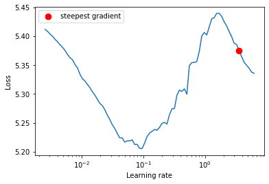
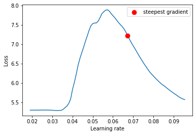
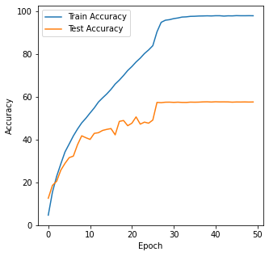
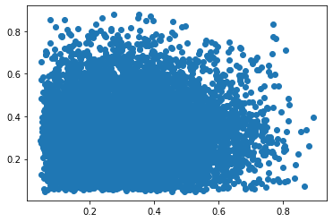
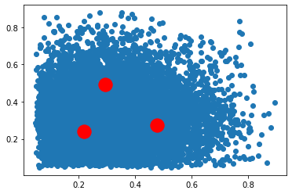
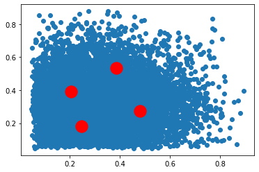
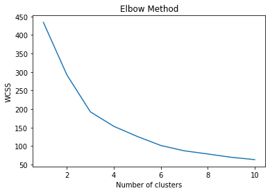

S10 Tiny Imagenet 
====================
This program is to train a Resnet18 model with Tiny ImageNet Dataset for 50 Epochs to achive >50% accuracy.

# Here are some steps performed 

1. Download Tiny Imagenet Data 
2. Splits (70:30) for Training and Testing 
3. Define the Train Loader and Test Loader
4. Define the Resnet18 Network 
5. Define Training function, Predict Function
6. Also connects to other modules for printing accuracy and plotting model parameters

# Some Key things used

Following changes are done:

1. Added Data Augmentations (Albumentatons)
i. Cutout
ii. Horizontal Flip
iii. Padding
iv. Random Crop  

2. Added LRFinder to get good starting learning rate
3. Used ReduceLROnPlateau strategey for scheduling learning rates

# Result
Achieved 57.98% Accuracy after 50 epochs , however the model trained over 50% accuracy from 18th Epoch onwards .

Kmean-COCO
============
One of the most popular object detection algorithms is YOLO (You Only Look Once). Just like any other model it also needs data in a specific format. So, when the manual annotators create bounding boxes using any Annotation tool, they must save the data in YOLO format for it to be trained using YOLO family of models.

In this assignment we tried to 
1.	Download the Annotation of COCO dataset
2.	Understand the annotation of the COCO format 
3.	Extracted the coordinates, demographics from the annotation file 
4.	Using the extracted data, run the Kmean Algorithm to find out the Anchor boxes 
5.	Plot a chart to show the centroid of anchor boxes 

COCO Annotation Format
==========================
It’s a JSON format and We have many meta data presents in the coco annotations but the ones we are interested in are:
Image Section which mentions the width and height of the image 
Categories section which mentions the Super category and Category of the image
Segmentation Section which contains the Image id and Bounding boxes 
The Bounding boxes contain the 
i)	Top left X position
ii)	Top left Y position
iii)	Width of the anchor box
iv)	Height of the anchor box

We used this dataset to calculate the centroid of the Anchor boxes (From 3-6). Here are the plots and the Centroid location for visualization

WCSS Plot
============
An ideal way to figure out the right number of clusters would be to calculate the Within-Cluster-Sum-of-Squares (WCSS). WCSS is the sum of squares of the distances of each data point in all clusters to their respective centroids.

