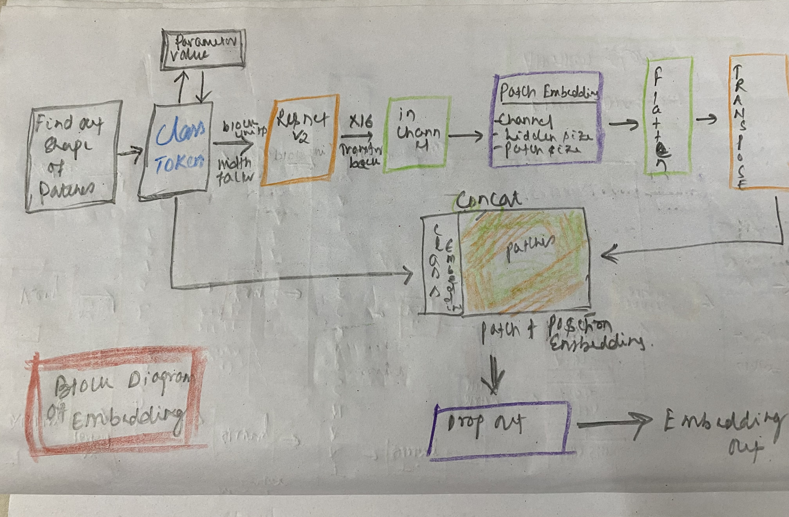

Block
=========
The input data here refers to the images. Images are sent to the network in batches. The Image is first divided into a fix size patch (16 * 16 in this case). For example, if the input image is of 224 x 224 then it will be divided into 16 * 16 patches then it would get 14 * 14 patches. 
First it would go through the layer normalization based on the hidden layer size. Then the normalized data is sent to the Attention layer. Please refer below the description of attention layer to find out the operations of the same. The Attention layer returns the Transformed patches and the attention weight for each. 
The Attention layer output is then added to the original patch which is then fed to the layer normalization. This output is then fed to the MLP layer which contains two Fully Connected layer. The fully connected layer focuses on transforming the encoded data to identify the classes that the image belongs to. 
This data then gets added to the attention layer output and returns to the calling function.

Embeddings
=============
This function creates the embedding of the input image. 
First it reads the input image and finds out the shape of it
Based on the image shape it defines the classification token which is a parameter that the network learns    
Finds out the grid size, Patch size (each patch is of size 16 * 16) and number of patches 
It then defines the Network which in this case is ResnetV2 
Once it passes through the network them the data gets flattened 
The Data gets transposed as it needs to be concatenated to the classification token.
Finally, the position embedding gets added to the input and Classification token 
The output passes through the Dropout layer and returns to the calling function 
‘

MLP
======
This is the layer which takes input as the Transformer Encoder layer which is the encoder output of data, positional encoding and classification token. The MLP layer contains 2 linear (Fully connected) layers and GELU activation function. The output of MLP helps in classifying the image 
‘

Attention
==========
This is the most important layer of VIT architecture. The steps here include,
The Query, Key and Value passes through the linear layer which gets converted into a better form of the Query, Key and Value 
Then all the three (Query, Key and value) passes through a transpose layer to perform transpose of the values 
Matrix Multiplication between query and key happens. This is the phase where the patches which are related gets a very high value to justify that they are closely related 
The attention score, Probability score and weights are calculated through SoftMax operation 
The result gets multiplied with value 
The attention output is the projection /transformation of the above context which gets fed into higher layers 
The attention and weights are returned to the calling function

‘

Encoder
===========
The Encoder layer gets the output from Linear layer + the Position encoder + the Classification token as input 
Then Normalization was performed to ensure that the values are not high 
As there are multiple heads defined for this, hence the data gets split and each head is processed separately. We can assume this as similar to channels in CNN where each channel is responsible for a specific task
Then another layer normalization helps stabilize the data which ultimately gets fed to the MLP layer. The encoder layer is the heart of VIT.
‘

