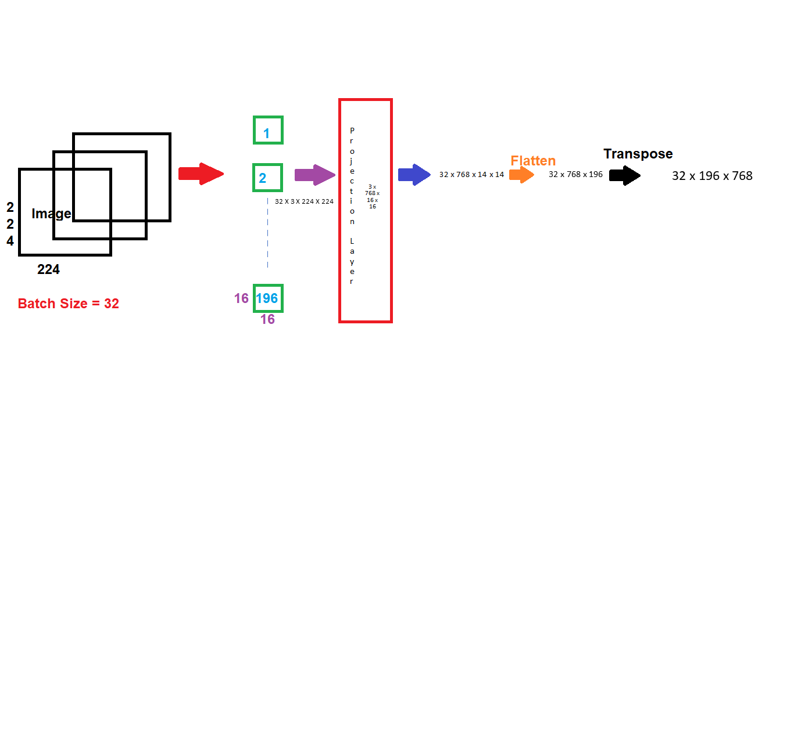
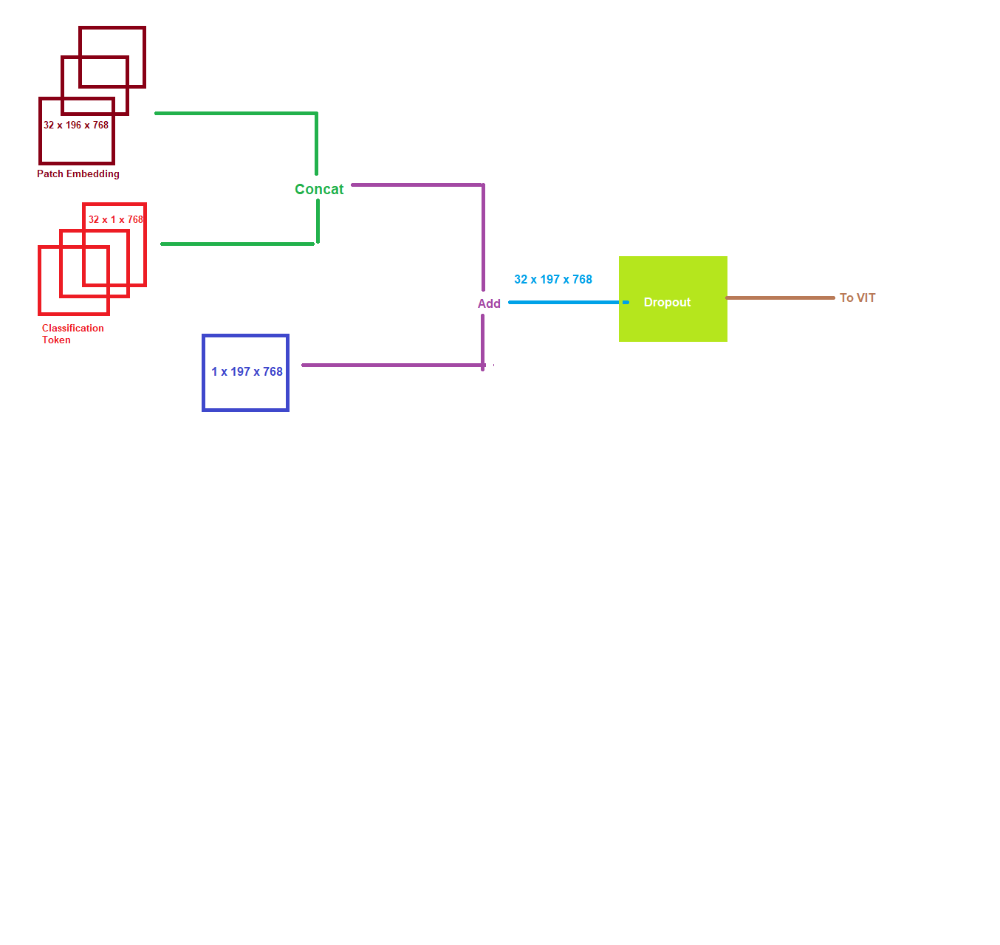
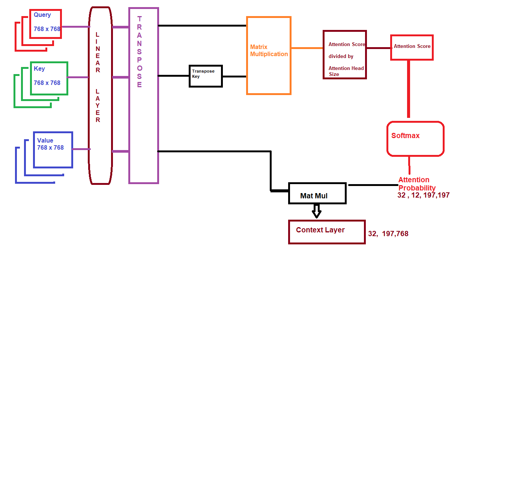
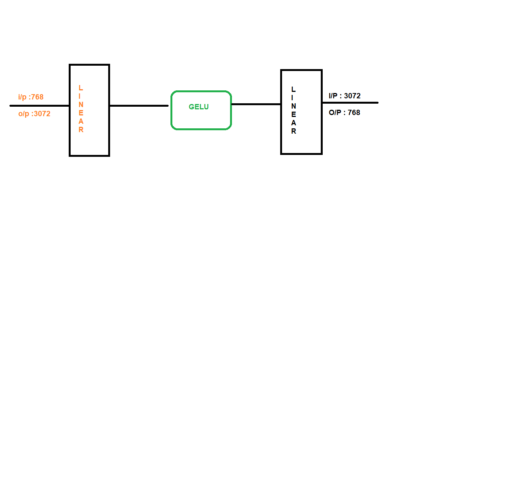

Patch Embedding
================
This class is responsible for working on the patches of the image and convert into some sort of embedding which can be processed further by adding more information

# Input:

1.	The Image sizes (224 x 224 x 3 in this example)
2.	Patch Size (16 x 16 in this example)
3.	Number of channels and 
4.	embedding Dimension

# Processing:
1.	The Image size (224 x 224 x 3) and patch size (16 x 16) are first checked to see if they are iterables using a user defined function. If not an iterable then the function returns a tuple which is iterable and the values of the tuple are image size, image size and patch size, patch size respectively 
2.	Then it calculates the number of patches required. In this case it’s going to be 
224 x 224 / 16 x 16 = 14 x 14. This is same as 196 
3.	Then it’s get projected into another form which is nothing but the output of a Conv2d layer 
32 x 3 x 224 x 224       3 x 768 x 16 x 16     32 x 768 x 14 x 14 
Here 32 = Batch size 
4.	Then the output value gets flattened to 32 x 768 x 196
5.	The value again needs to be transposed and reshaped as 32 x 196 x 768

# Output:

The Embedded patches 

VIT Embedding
================

# Input:

Configuration file

# Processing:

1.	Create a Classification token which is a learnable parameter. In this case it’s going to be 32 x 1 x 768
2.	Define Position Embedding. In this case it’s going to be 1 x 197 x 768
Please Note: Here 786 is the hidden dimension 
3.	Get the Batch size from Pixel values 
4.	Get the Patch embedding from the patch embeddings class
5.	Expand the class tokens to ensure that it’s expanded as per the defined batch size
6.	Concatenate the patch embedding with class tokens
7.	Add the position embedding to the resultant embedding 
8.	Add dropout to the embedding 
9.	The final embedding is fed to the VIT 

# Output:

The Embedding with Patch, Positional information and classification token

VIT Config
===========

This is a configuration class which creates an object with specified configuration which is used further in the processing. The configurations include
1.	Hidden Size
2.	Number of Hidden Layers
3.	Number of Attention Heads
4.	Intermediate Size
5.	Hidden Activation
6.	Hidden Dropout Probability
7.	Attention Probability
8.	Initialization Range
9.	Layer Normalization eps
10.	Image size
11.	Patch Size
12.	Number of channels

VIT Self Attention
====================
# Input:

•	No of attention Heads
•	Attention Head size (768/12 = 64)
•	All Head size (12 * 64 = 768)

# Processing:

1.	Check if the number of attention heads are more than 0. 
2.	Define query layer, key layer and value layer which is a Linear Layer of size 768 x 768 in this case
3.	Transpose the query, key and value using the transpose_for_scores function 
4.	Calculate the attention score by performing a matrix multiplication between query value and transpose of key value
5.	Calculate updated attention score by dividing it with attention head size
6.	Perform SoftMax on the resultant value as the value would have exploded after multiplication 
7.	Add dropout to the attention probability
8.	Find out context layer which is the matrix multiplication of the Attention Probability and Value layer 
9.	Return the output to calling function
 
 
 
# Output:

Context Vector

VIT Self Output
====================
•	This class contains a dense layer of Hidden states (768 x 768)
•	Then a drop out layer is added and the output is returned to the calling function

VIT Attention
==================

# Input:

•	The Attention Object
•	The output from last layer
•	The Prune Head (This is to prune the heads that are not important)

# Processing:

1.	We get the self-output from the attention block of the previous class
2.	The attention output is calculated using self-output and hidden layer 
3.	The output is then returned 

VIT Intermediate and VIT Output
===============================

# Input: 

Hidden layer dimension

# Processing:

1.	The Hidden states go through a dense layer
2.	Gelu Activation function is applied on it 
3.	Then the hidden state values are returned 

 

VIT Layer
=============

# Input:

•	Initialize Attention
•	Initialize Intermediate
•	Initialize output
•	Initialize layer Normalization After
•	Initialize layer Normalization Before

# Processing

1.	Get the self-Attention output by sending the hidden states to layer normalization before, Head mask and output attention
2.	Get the 0th vale out which is the self-attention that we are interested in 
3.	Then we take the first value as the output of self-attention 
4.	Add the Attention output and add it to the hidden states and store it as hidden states
5.	Send the value to Layer normalization after
6.	Let the output pass through the Intermediate layer
7.	Finally, the layer output is calculated and the output as well which helps in classification

VIT Encoder
===============
This is the overall VIT layers. This layer is repeated twice. 
There is a block of code here to read the pretrained model
We get all the encoder output 
Then it gets the classification token
The classification token is then sent to the Layer normalization
Sequence output then sent to Pooler (VIT Pooler class takes the Hidden state twice and performs linear function)
Finally it gets converted from 768 to 1000 which is number of classes here 

The Final Steps
================

1.	Send the input – 32 x 3 x 224 x 224
2.	Get the Embedding using VITEmbedding
3.	Encoder using the VIT Encoder
4.	Perform Layer Normalization
5.	Embedding output – 32 x 197 x 768
6.	Encoder output is a tuple with 3 layers
7.	The sequence output - 32 x 197 x 768
8.	The Predict Vector
a.	Layer Normalization
b.	Dense Layer 
c.	Add Tanh Activation for Final Classification Layer
d.	Take the first token out of the activation
e.	Send it to the Dense Layer 
f.	Activate the above
g.	Get the final pooled shape – 32 x 768
9.	Define the Classifier of which the final is 100 
10.	Send the Pooled output to classifier and get 32 x 100 

