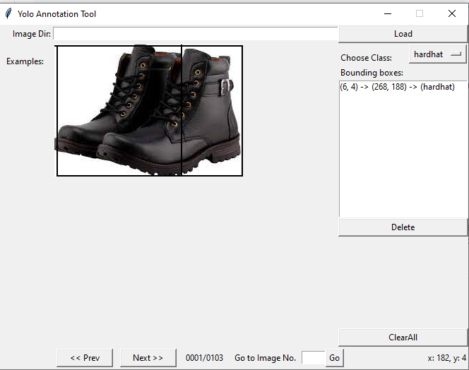
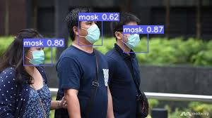
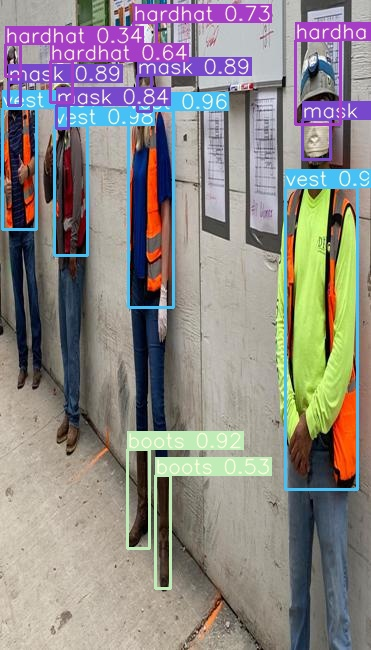

# Developers

1. Monimoy Purkayastha (monimoyd@gmail.com) 
2. Nihar Kanungo (nihar.kanungo@gmail.com)

# yolo Object Detection transfer learning

This Notebook Performs Object Detection using the YOLO V3 pretrained weights and Configuration file. The Idea here is to try and detect an object already present in Imagenet dataset 

# YoloCustomObjectDetection
**

Train a YoloV3 Model for Custom Images
=======================================
YOLOV3 is one of the most popular Object Detection algorithm with very fast inferencing speed. This repository contains the codes to train the YoloV3 model with custom images of four different classes. If you are interested to train your custom image with YOLOv3 then here is how you can achieve the same.

Get yourself Motivated 
========================
“There is no AI without IA. “

Perhaps the most important task in object detection is to prepare the ground truth for machine learning models. This determines the efficiency of machine learning performance. Even though its mechanical but preparing Ground Truth is tedious, boring and time consuming. However, if you are a data scientist who wants to excel you need to do the hard work. I am sure once you see the output you will forget the pain.

# "A dream does not become reality through magic; it takes sweat, determination, and hard work."

1.	Collect Images of the four classes
a.	Mask
b.	Vest
c.	Hardhat
d.	Boots

2.	Download and Install the Image annotation tool by following the below steps 

•	Clone this repo: https://github.com/miki998/YoloV3_Annotation_Tool

•	Follow the installation steps as mentioned in the repo.

•	Annotate the images using the Annotation tool

3.	Check the annotation files and ensure all are correct. For each image you must see one txt file which contains annotation

Now go and treat yourself with a   . You have done all the heavy lifting and should feel proud about yourself 

The Architect
===============
The Architect is the main person starting design till deployment. Let’s prepare the entire solution for the world to use and admire.

YoloV3 Simplified for training on Colab with custom dataset.
You'll need to download the weights from the original souce.

1.	Create a folder called weights in the root (YoloV3) folder

2.	Download from: https://drive.google.com/open?id=1LezFG5g3BCW6iYaV89B2i64cqEUZD7e0

3.	Place 'yolov3-spp-ultralytics.pt' file in the weights folder:

# Test if the setup is correct

run this command python train.py --data data/smalcoco/smalcoco.data --batch 10 --cache --epochs 25 –nosave
All okay? Now let’s move forward

4.	We need to modify the custom.data file. For 1 class example, your file will look like this:

  classes=1
  train=data/customdata/custom.txt
  test=data/customdata/custom.txt 
  names=data/customdata/custom.names

Now you understand that here I had to make the classes = 4. You can change it to the number of classes that you need to train on.

5.	Modify the custom.txt file to include the path of all the images
./data/customdata/images/1.jpg
./data/customdata/images/2.jpg
./data/customdata/images/3.jpg
...

The Main Actor
================
You may see a lot of errors in your code if you don’t do these steps . This is the main file which holds all the configurations .

6.	For COCO's 80 classes, VOLOv3's output vector has 255 dimensions ( (4+1+80)*3). Now we have 4 classes, so we would need to change it's architecture to (4+1+4)*3) = 27

7.	Copy the contents of 'yolov3-spp.cfg' file to a new file called 'yolov3-custom.cfg' file in the data/cfg folder.

8.	Search for 'filters=255' (you should get entries entries). Change 255 to 27 = (4+1+4)*3

9.	Search for 'classes=80' and change all three entries to 'classes=4'

10.	Modify :

•	burn_in to 100
•	max_batches to 5000
•	steps to 4000,4500

11.	Don't forget to perform the weight file steps mentioned in the section above.

12.	Run this command python train.py --data data/customdata/custom.data --batch 10 --cache --cfg cfg/yolov3-custom.cfg --epochs 300 --nosave

# The Day

After spending a lot of time and effort I am sure you would get the same feeling that we used to get during our JEE result 😊. Exaggerated? But that’s the fun like function movies.
Once the model is trained, now is the time to inference it using some known images from training to ensure it’s working fine 

Did you realize it’s working as expected? Now let’s perform the same on videos and see how well it performs 

# A friend in Need a Friend indeed
Let’s call our friend “ffmpeg” to read the video file and convert into multiple images which we would use to infer using the trained model.
Now run all the images through the Detect.py file which contains the model
Once all the images are inferred, ask the friend again to convert the images as video.
Now download the video and enjoy 😊

If you have any questions, please feel free to reach out to us. 
 
 Output
 =========
 https://youtu.be/6W_WGBakjJo

 

